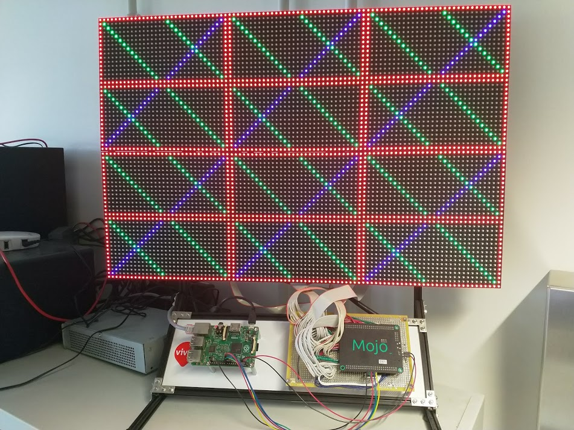

# Mojo RGB Led Panel Control

This repo contains the VHDL project that deploys on the Mojo so it can be driven from SPI using a Raspberry Pi.



## Panel layout

```text
--------------------------------
-                              -
-                              -
-         UPPER BUFFER         -
-                              -
-                              -
--------------------------------
-                              -
-                              -
-         LOWER BUFFER         -
-                              -
-                              -
--------------------------------
```

## Line and pixel addressing

```text
0 1 2 3 4 5 6 7 8 9 ......
1
2
3
4
5
6
7
8
9
.
.
.
```