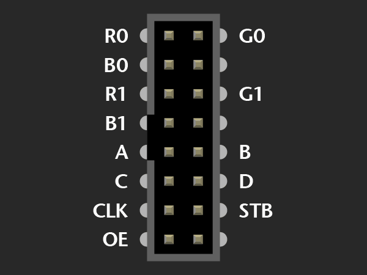

# Mojo RGB Led Panel Control

The Meme Machine project was created by Sille Van Landschoot and Nico De Witte as part of student project for the VIVES University of Bruges (Belgium).

This repo contains the VHDL project that deploys on the Mojo so it can be driven from SPI using a Raspberry Pi.


## Buffer layout

Internally each panel component contains four buffers of 16 lines of 32 pixels (a pixel being R, G and B) each. These buffers are grouped together as an upper and lower part. Together they contain the information for a full frame.

```text
--------------------------------
-                              -
-                              -
-         UPPER BUFFER         -
-                              -
-                              -
--------------------------------
-                              -
-                              -
-         LOWER BUFFER         -
-                              -
-                              -
--------------------------------
```

While one frame (group of upper and lower buffer) is used as a display buffer, the other frame can be used for writing using the SPI interface. The buffers groups can be switched using an SPI command.

## Line and pixel addressing

```text
0 1 2 3 4 5 6 7 8 9 ......
1
2
3
4
5
6
7
8
9
.
.
.
```

## SPI Commands

### Sending pixel data to the controller

The display currently supports two modes, line mode and frame mode.

#### Line Mode

Format:

```text
| command | panel id | line address |  pixel data  |
|   0x01  |   0-254  |    0 - 31    |  R |  G | B  |
|  1 byte |  1 byte  |    1 byte    | 32 x 3 bytes |
```

* By using a panel id of 255, you can write the information to all panels
* Line addressing starts at the top with 0

#### Frame Mode

Format:

```text
| command | pixel data  |
|   0x03  | R |  G | B  |
|  1 byte | 6 x 32 x 32 x 3 bytes |
```

So in other words in frame mode, the full data size is 1 byte for the command and 18432 bytes of rgb data.

### Requesting a buffer switch

After sending data to the controller you need to request a buffer switch to get the image to display.
This can be achieved by sending a buffer switch command via SPI.

Format:

```text
| command |
|   0x08  |
|  1 byte |
```

In an extreme case where you were to lower the refresh rate of the panels and set the clockrate of SPI very high you may need to add a delay between a buffer switch request and sending new data. If not it may occur that the new data is written to the current display buffer. This is a side effect of the fact that the buffer switch happens after a full frame is displayed. So there may be a slight delay between the request for a buffer switch and the actual switch.

## The Panels

More info on the panels can be found at [https://learn.adafruit.com/32x16-32x32-rgb-led-matrix/new-wiring](https://learn.adafruit.com/32x16-32x32-rgb-led-matrix/new-wiring). The ones in our possession are equipped with a **variant B** socket.


